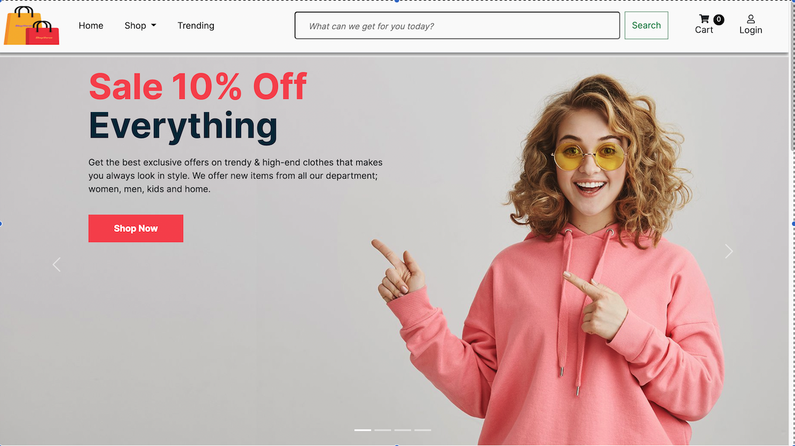
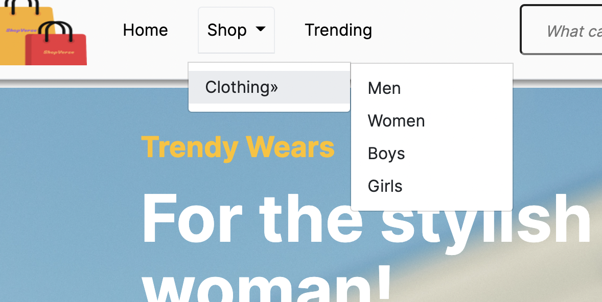
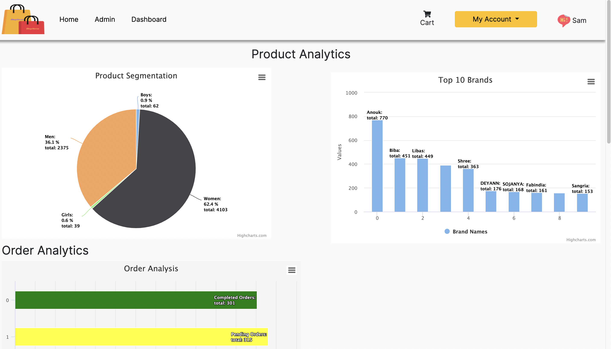

<div id="top"></div>

<!-- PROJECT LOGO -->
<br />
<div align="center">
  <a href="https://github.com/SamAdefemi007/ShopVerse">
    
  </a>

<h3 align="center">ShopVerse</h3>

  <p align="center">
    Shopverse is an ecommerce application for shopping high-end retail wears securely and safely. The application was built in completion of the Enterprise Software development course towards a masters degree program in the University of Aberdeen.
    <br />
    <a href="https://github.com/SamAdefemi007/ShopVerse"><strong>Explore the docs »</strong></a>
    <br />
    <br />
    <a href="https://github.com/github_username/repo_name">View Demo</a>
    ·
    <a href="https://github.com/SamAdefemi007/ShopVerse/issues">Report Bug</a>
    ·
  </p>
</div>

<!-- TABLE OF CONTENTS -->
<details>
  <summary>Table of Contents</summary>
  <ol>
    <li>
      <a href="#about-the-project">About The Project</a>
      <ul>
        <li><a href="#built-with">Built With</a></li>
      </ul>
    </li>
    <li>
      <a href="#getting-started">Getting Started</a>
      <ul>
        <li><a href="#prerequisites">Prerequisites</a></li>
      </ul>
    </li>
    <li><a href="#usage">Usage</a></li>
    <li><a href="#roadmap">Roadmap</a></li>
    <li><a href="#contributing">Contributing</a></li>
    <li><a href="#license">License</a></li>
    <li><a href="#contact">Contact</a></li>
    <li><a href="#acknowledgments">Acknowledgments</a></li>
  </ol>
</details>

<!-- ABOUT THE PROJECT -->

## About The Project



<p align="right">(<a href="#top">back to top</a>)</p>

### Built With

- [Django](https://www.djangoproject.com/)
- [CSS](https://developer.mozilla.org/en-US/docs/Web/CSS)
- [HTML](https://developer.mozilla.org/en-US/docs/Learn/Getting_started_with_the_web/HTML_basics)
- [Bootstrap](https://getbootstrap.com)

<p align="right">(<a href="#top">back to top</a>)</p>

<!-- GETTING STARTED -->

## Getting Started

To setup locally, follow the steps bellow

1. Clone the repo

   ```sh
   git clone https://github.com/github_username/repo_name.git
   ```

2. Activate the virtual environment
   ```sh
   Source venv/bin/activate
   ```
3. Setup the Postgresql username and password in Database Settings or change the database to sqlite3

   ```sh
   DATABASES = {
    'default': {'ENGINE': 'django.db.backends.postgresql','NAME': 'shopverse','USER': 'postgres', 'PASSWORD': 'samuelolaniyan','HOST': '127.0.0.1', 'PORT': '5432'
    }
   }
   ```

4. Makemigrations and migrate appropriately

   ```sh
   Python manage.py makemigrations
   ```

   ```sh
   Python manage.py migrate
   ```

5. Runserver
   ```sh
   Python manage.py runserver
   ```

### Prerequisites

- Django
  ```sh
  pip install django
  ```
- Behave
  ```sh
  pip install behave
  ```
- Selenium
  ```sh
  pip install selenium
  ```
- Faker
  ```sh
  pip install faker
  ```
- Django-crispy-forms
  ```sh
  pip install django-crispy-forms
  ```
- psycopg2
  ```sh
  brew install psycopg2
  ```

## Application Usage

- Homepage
  The application can be accessed from the index directory of the website. The products page can be accessed via three methods from the homepage

  1. The navbar has a "Shop" nav-link that contains the different categories of the available clothes(Men, women, boys and girls)
     <br>
     <br>
     
     <br>
     <br>
  2. The products page also can be accessed via the "shop now" button on the homepage and also the different collection card-items on the page.

- Login
  All users are able to navigate most of the pages of the application except the payments page and the user will be redirected to login when trying to place an order as an anonymous user. To test the application as logged in user, you can signup and create new login details or use the below

  ```sh
  Username :Admin       Password:  Aberdeen2022
  ```

A superuser will need to be created to access the admin page of the application

```sh
python manage.py createsuperuser

```

The superuser page allows access to the admin view of models, as well as the dashboard(see below)


- Products and Carts
  A cart is maintained for each user and users are able to add products to cart via the product page and the product detail page. The cart page also allows users to change the quantity of the item purchased before checkout.

- Checkout
  The checkout page leads to the payments page which has not been fully implemented and an order is created when payments have been confirmed.

<p align="right">(<a href="#top">back to top</a>)</p>

## License

Free to use for all purposes

<p align="right">(<a href="#top">back to top</a>)</p>

<!-- CONTACT -->

## Contact

Samuel Olaniyan - t14so21@abdn.ac.uk

Project Link: [https://github.com/SamAdefemi007/ShopVerse](https://github.com/SamAdefemi007/ShopVerse)

<p align="right">(<a href="#top">back to top</a>)</p>

<!-- ACKNOWLEDGMENTS -->

## Acknowledgments

- Data gotten from [https://data.world/datasets/ecommerce](https://data.world/datasets/ecommerce)
- Page Design Inspiration [https://htmlcodex.com/?s=eshopper](https://htmlcodex.com/?s=eshopper)
- Page Design Inspiration [https://templatemo.com/tm-571-hexashop](https://templatemo.com/tm-571-hexashop)
- Page Design Inspiration [https://html.design/?s=famm](https://html.design/?s=famm)
- Code Attribution [Django 3 By Example: Build powerful and reliable Python web applications from scratch, 3rd Edition]

<p align="right">(<a href="#top">back to top</a>)</p>
